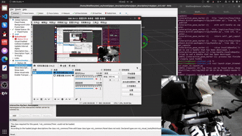
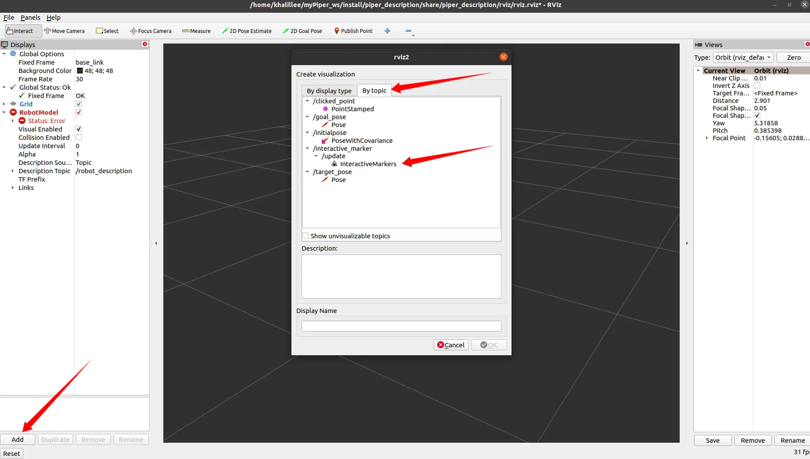
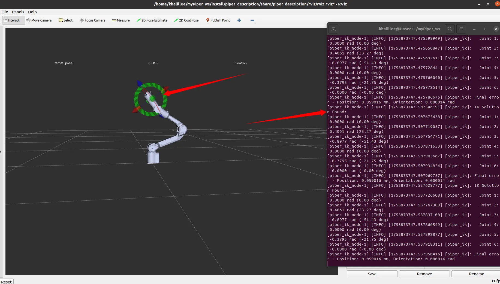

# Piper_kinematics-松灵PiPER机械臂运动学工具

通过Eigen库实现松灵PiPER机械臂的运动学逆解示例



## 标签
- Eigen
- 运动学逆解
- 松灵PiPER机械臂
- Eigen3

## 仓库
- 跳转仓库[https://github.com/vanstrong12138/Piper_kinematics](https://github.com/vanstrong12138/Piper_kinematics)
- 主仓库[https://github.com/agilexrobotics/Agilex-College](https://github.com/agilexrobotics/Agilex-College)

## 环境配置：

- 安装Eigen3
```bash
sudo apt install libeigen3-dev
sudo apt install ros-noetic-eigen-conversions 
```

## 编译
```bash
cd your_ws
source devel/setup.sh
catkin_make
```

## 运行RVIZ仿真

1. 启动RVIZ仿真
```bash
roslaunch piper_description display_nocap_urdf_ik.launch
```

2. 启动运动学逆解节点
```bash
roslaunch piper_kinematics piper_ik.launch
```

3. 在RVIZ中interactive_marker_utils实现三维空间目标点发布



## 真机部署

1. 激活CAN通信
```bash
cd piper_ros
./find_all_can_port.sh 
./can_activate.sh 
```

2. 启动PIPER真机控制节点
```bash
roslaunch piper_kinematics start_single_piper_ik_rviz.launch
```

3. 启动运动学逆解节点
```bash
roslaunch piper_kinematics piper_ik.launch
```

4. 在RVIZ中interactive_marker_utils实现三维空间目标点发布


